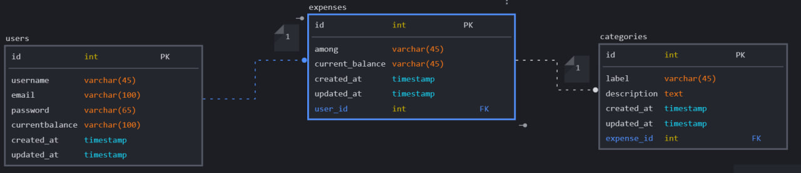

# Expenses Master

Simplifying expense management for seamless financial tracking and effortless control.

# Teams Members

- Ayodeji Odemo 
- Wachiou Bouraima

|Firstname| lastname| roles|
-----------|--------------|----------------|
|[Ayodeji](https://github.com/Vicodevee)| [Odemo](https://github.com/Vicodevee)| [Front-end Developer](https://github.com/Vicodevee)|
|[Wachiou](https://wasscodeur.me)| [BOURAIMA](https://wasscodeur.me)| [Back-end Developer](https://github.com/WassCodeur)|

# Technologies

- Laguages: HTML, CSS, Javascript, Python
- Frameworks: Flask, Bootstrap
- Libraries: jQuery, Chart.js
- Database: MySQL
- Tools: Git, Github, VS Code, Postman, Heroku, alwaysdata, Trello, Slack, Figma, sqlDBM, balsama, Microsoft visio
- Books/ressources:Alx Materials, Flask Web Development by Miguel Grinberg, Flask Documentation, Bootstrap Documentation, W3Schools, Stackoverflow, Youtube, Google, etc.

# Project Description

Simplifying expense management for seamless financial tracking and effortless control.

# Platforms

- Web browser: The primary platform for running the ExpensesMaster application, as it will be developed as a web-based application accessible through browsers.
- Mobile: The ExpensesMaster application will be developed as a mobile-friendly web application, accessible through mobile browsers.

# Features

- Log In & Sign Up: Users will be able to create accounts and log in to the application.
- Create Expense: Users will be able to create expenses.
- View Expense: Users will be able to view expenses.
- Update Expense: Users will be able to update expenses.
- Delete Expense: Users will be able to delete expenses.
- View Expense Report: Users will be able to view expense reports.
- View Expense Chart: Users will be able to view expense charts.
- View Expense Summary: Users will be able to view expense summaries.
- View Expense Category: Users will be able to view expense categories.
- View Expense Category Report: Users will be able to view expense category reports.
- View Expense Category Chart: Users will be able to view expense category charts.
- View Expense Category Summary: Users will be able to view expense category summaries.
- View Expense Category: Users will be able to view expense categories.

# User Stories

- As a user, I should be able to create an account.
- As a user, I should be able to log in to my account.
- As a user, I should be able to create an expense.
- As a user, I should be able to view my expenses.
- As a user, I should be able to update my expenses.
- As a user, I should be able to delete my expenses.
- As a user, I should be able to view my expense reports.
- As a user, I should be able to view my expense charts.
- As a user, I should be able to view my expense summaries.
- As a user, I should be able to view my expense categories.
- As a user, I should be able to view my expense category reports.
- As a user, I should be able to view my expense category charts.
- As a user, I should be able to view my expense category summaries.
- As a user, I should be able to view my expense category.

# Data Modelling

# Let's connect with us

- [Ayodeji Odemo](https://www.linkedin.com/in/Vicodevee/)
- [Wachiou Bouraima](https://www.linkedin.com/in/wasscodeur/)

